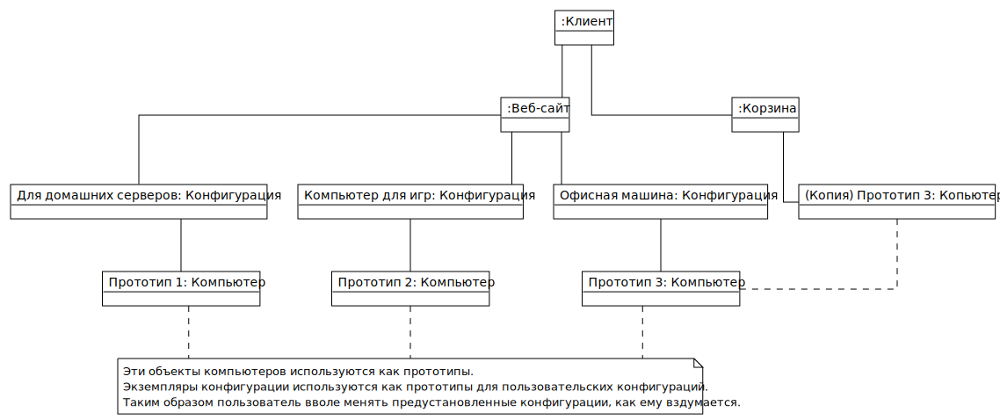
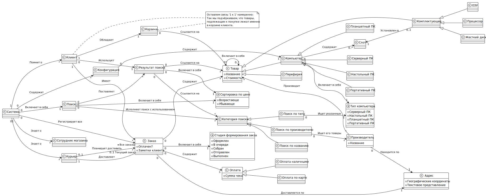
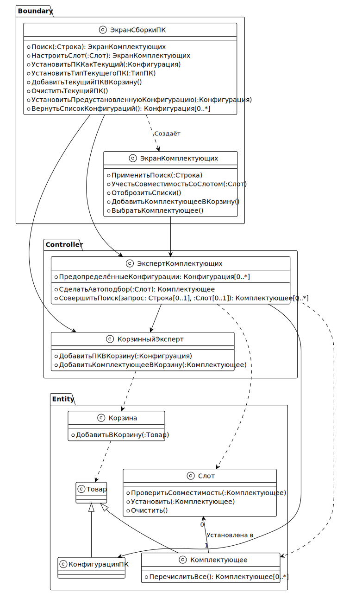
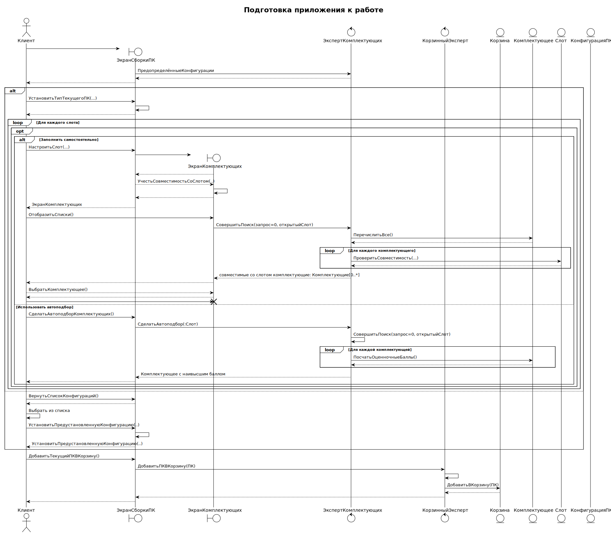
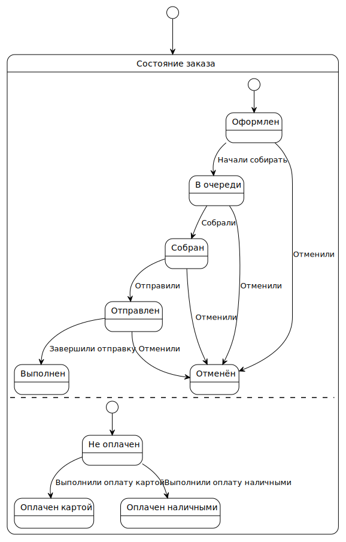

## Задание. Варинат 64

**Магазин компьютеров** предлагает возможность приобретения своих **товаров** через **Интернет**. **Клиент** может выбрать **компьютер** на **web-странице** магазина. **Компьютеры** подразделяются на **серверы**, **настольные**, **портативные** и **планшетные**. **Заказчик** может выбрать подходящую **стандартную конфигурацию** из списка и детально ознакомиться с ней на **отдельной web-странице**. Если **стандартная конфигурация** ему не подходит, он может построить требуемую ему **конфигурацию** в **диалоговом режиме**. **Компоненты** конфигурации (такие, как **оперативная память**, **процессор**, **жесткий диск** и т. п.) представляются как **список** для выбора из **доступных альтернатив**. Для каждой новой **конфигурации** **система** может подсчитать **цену**. Если **конфигурация** неполна, т. е. в ней отсутствует важный **компонент**, то при заказе **веб-страница** оповещает об этом клиента и предлагает выбрать **недостающий компонент** из списка. **Клиент** может дополнить **конфигурацию** по своему **выбору**, либо приобрести **неполную конфигурацию**. **Клиент** может приобретать в **магазине** не только **компьютеры**, но и **отдельные комплектующие** и/или **периферийные устройства**. На странице магазина работает **поиск** комплектующих и периферийных устройств по их типу, производителю, названию. **Результаты поиска** могут быть отсортированы клиентом по цене.

Чтобы оформить **заказ**, **клиент** должен заполнить **электронную форму** с **адресом для доставки товара**, а также **деталями...**, касающимися **...оплаты**. **Оплата** компьютеров осуществляется **наличными** **курьеру**, осуществляющему **доставку**, или по **банковской карте**. Для **оплаты** по карте клиент сообщает её **реквизиты** **интернет-магазину**. Он, в свою очередь, обращается к **банковской системе** с **запросом** на **оплату заказа**. **Ответ на запрос** может быть положительным или отрицательным. При **положительном ответе** заказ помечается как **оплаченный**. При **отрицательном ответе** **клиент** может отказаться от **покупки**, либо скорректировать **реквизиты карты** для оплаты, либо выбрать **оплату курьеру** по получении. После успешного оформления заказа **система** отправляет клиенту по **электронной почте** **сообщение с подтверждением** получения заказа вместе с относящимися к нему **деталями** (стоимость, номер счета, и т. п.). Пока **клиент** ожидает прибытия **компьютера**, он может проверить **состояние заказа** (поставлен в очередь / собран / отправлен). **Данные** об оформленных заказах **интернет-магазин** пересылает **складской системе**, ведущей **учёт запасов** компьютерных компонентов и сборки заказов. **Отправленные заказы** помечаются как **поставленные в очередь**. **Собранные компьютеры** вместе передаются со склада в **отдел доставки**, при этом **заказ помечается** как **собранный**. **Отдел доставки** направляет **заказы** **клиентам** (статус заказа – отправлен). Если **заказ** оплачивается **наличными**, курьер по возвращении **передаёт деньги** в кассу. Работник интернет-магазина, принимая деньги, помечает заказ как оплаченный. По окончании **работы** с заказом, он помечается в **системе** как **выполненный**.

Вариант задания предусматривает разработку схемы базы интернет-магазина компьютерной техники. 

## Задание 1. РАЗРАБОТКА КОНЦЕПТУАЛЬНОЙ МОДЕЛИ КЛАССОВ

### Текстуальный анализ

Текстуальный анализ предметной области происходит с использованием проблемы, рассматриваемой в задании. С его помощью можно выделить классы-кандидаты (наиболее часто встречающиеся и представляющие наибольший интерес). Для наглядности классы – кандидаты в описании предметной области мы выделили цветами.

### Список классов-кандидатов

Представить список классов-кандидатов полный. Затем средствами редактора вычеркнуть не нужные. Список можно представить, как таблицу:

| Классы                          |
|---------------------------------|
| **На основе существительных**   |
| ~~Магазин компьютеров~~         |
| Товар                           |
| ~~Интернет~~                    |
| Компьютер                       |
| Веб-страница                    |
| Сервер                          |
| Настольный ПК                   |
| Портативный ПК                  |
| Планшетный ПК                   |
| Заказчик, Клиент → Пользователь |
| Конфигурация                    |
| ~~Стандартная конфигурация~~    |
| Компонент                       |
| ~~Выбор~~                       |
| Отдельные комплектующие         |
| Перефирийные устройства         |
| Поиск                           |
| Категория поиска                |
| Результат поиска                |
| ~~Электронноая форма~~          |
| Заказ                           |
| Детали оплаты                   |
| Реквизиты карты                 |
| Банковская система              |
| ~~Складская система~~           |
| ~~Состояние заказа~~            |
| Оплата                          |
| Оплата наличными                |
| Оплата по карте                 |
| ~~Учёт запасов~~                |
| ~~Отдел доставки~~              |
| **Введённые искуственно**       |
| _Корзина_                       |
| _Вид компьютера_                |

## Список ассоциаций-кандидатов

Представить список ассоциаций-кандидатов полный. Затем средствами word вычеркнуть не нужные. Список можно представить, как таблицу.

**Заметка:** Подчеркнём, что мы строим бизнес-модель предметной области. Следовательно мы можем использовать лишь связи:

- Наследования (Наследует);
- Асоциации (Связан с).


Составим таблицу ассоциаций:

| Участник ассоциации     | Вид ассоциации | Участник ассоциации|
|-------------------------|----------------|--------------------|
| Сервер                  | Наследует      | Компьютер          |
| Настольный ПК           | Наследует      | Компьютер          |
| Портативный ПК          | Наследует      | Компьютер          |
| Планшетный ПК           | Наследует      | Компьютер          |
| Пользователь            | Связан с       | Корзина            |
| Пользователь            | Связан с       | Заказ              |
| Пользователь            | Связан с       | Сайт               |
| Корзина                 | Связан с       | Товар              |
| Поиск                   | Связан с       | Результат поиска   |
| Поиск                   | Связан с       | Сайт               |
| Поиск                   | Связан с       | Конфигурация       |
| Поиск                   | Связан с       | Категория поиска   |
| Результат поиска        | Связан с       | Категория поиска   |
| Компьютер               | Наследует      | Товар              |
| Перефирийное устройство | Наследует      | Товар              |
| Отдельное комплектующее | Наследует      | Товар              |
| Оплата по карте         | Наследует      | Оплата             |
| Поиск                   | Связан с       | Результаты поиска  |
| Поиск                   | Связан с       | Категория поиска   |
| Результат поиска        | Связан с       | Категория поиска   |
| Поиск по типу           | Наследует      | Категория поиска   |
| Поиск по производителю  | Наследует      | Категория поиска   |
| Поиск по названию       | Наследует      | Категория поиска   |
| Поиск по производителю  | Связан с       | Производитель      |
| Товар                   | Связан с       | Производитель      |

## Глоссарий

- **Класс** &mdash; обобщённое описание однородных объектов.
- **Объект** &mdash; представитель, подходящий под описание классом. 
- **Наслдование** &mdash; создание нового класса путём расширения существующего.
- **Ассоциация** &mdash; взаимозависимость двух классов или объектов между собой, через которую они могут обмениваться сообщениями.

## Начальная модель классов


## Диаграммы объектов

Тут не менее трёх (3) диаграмм объектов, как пример мгновенного представления диаграммы классов.




## Задание 2. РАЗРАБОТКА МОДЕЛИ ВАРИАНТОВ ИСПОЛЬЗОВАНИЯ

### Текстуальный анализ

Текстуальный анализ проводится с целью выявления потенциальных действующих лиц (actors) и вариантов использования (use cases) системы.

### Список действующих лиц и их задач

Тут список действующих лиц и их задач.

| Действующее лицо            | Задачи                     |
|-----------------------------|----------------------------|
| **Клиент:**                 | Поиск товаров              |
|                             | Оформление заказов         |
|                             | Оплата заказов             |
|                             | Подбор комплектующих       |
| ~~**Банковская система:**~~ | ~~Провести транзакцию~~    |
| **Система распределения:**  | Обновить объемы товара     |
|                             | Назначить курьера          |
| **Курьер:**                 | Принять оплату             |
|                             | Отметить заказ оплаченым   |
| **Работник магазина:**      | Отметить заказ завершённым |

### Краткое описание каждого варианта использования

Тут краткое описание каждого обнаруженного варианта использования. Выполниv ранжирование вариантов использования:

- 1 - самый важный;
- 2 - важный;
- 3...

важность понижается. Представим результат в виде таблицы и отсортируем по рангу: 

| Вариант использования     | Краткое описание                                                         | Ранг |
|---------------------------|--------------------------------------------------------------------------|------|
| Искать товрары            | Воспользоваться поиском на сайте.                                        | 1    |
| Оформить заказ            | Запустить заказ на сборку и доставку.                                    | 1    |
| Назначить курьера         | Назначить ответственного за заказ.                                       | 1    |
| Обновить объемы товара    | Загрузить информацию, сколько товара распродано/завезено.                | 1    |
| Сменить статус заказа     | Пометить заказ оплаченым, в пути, обработанным.                          | 1    |
| Добавить товары в корзину | Пользователь может добавлять товары в корзину, чтобы сформировать заказ. | 2    |
| Подбрать комплектующие    | Воспользоваться конструктором на сайте.                                  | 3    |

### Диаграмма вариантов использования


## Задание 3. УТОЧНЕНИЕ КОНЦЕПТУАЛЬНОЙ МОДЕЛИ КЛАССОВ

### Список атрибутов-кандидатов

#### Товар

- Название
- Стоимость
- Производитель

**Ошибка планирования**: `Компьютер` &mdash; составной товар, чего модель не учитывает.

**Применить**: Шаблон проектирования «Компоновщик».

#### Заказ

- Адрес доставки;
- Стоимость (исчисляемое);
- Оплачен?
- Стадия формирования заказа;
- Заметки клиента.

#### Тип компьютера

- Настольный ПК
- Планшетный ПК
- Портативный ПК
- Серверный ПК

#### Оплата

- Сумма чека.

#### Сервер

**Переименовать**: `Сервер` → `Серверный ПК`

#### Отдельное комплектующее

**Изничтожить**: Ошибка планирования &mdash; `Компонент` тоже, что и `Отдельное комплектующее`

#### Компонент

**Переиментовать**: `Компонент` → `Комплектующее` 

#### Адрес

**Ввести**: Клас `Адрес`

- Географические координаты
- Текстовое представление

**Заметка**: Географически координаты (широта, долгота) &mdash; важный компонент при доставке товара. Так, сохраняется совместимость со сторонними картами &mdash; Google Maps, Y.Maps, 2Гис, прочие... 

#### Производитель

- Имя
- Адрес

#### Веб-сайт

**Переименовать**: `Веб-сайт` → `Система`

Наша цель &mdash; описать полноценную систему, не только взаимодействие клиента с магазином. Понятие «Веб-сайт» сильно ограничено: такое название подразумевает, что идёт работа исключительно с веб-страницей магазина, но не с системой в целом. Веб-страница &mdash; лишь маленькое окошко в систему, которое позволяет совершить лишь ограниченный набор действий.


#### Стадия формирования заказа

**Ввести**: Перечислимое `Стадия формирования заказа`

- Оформлен
- В очереди
- Собран
- Отправлен
- Выполнен

#### Результаты поиска

- Сортировка по цене 

#### Сортировка по цене

**Ввести**: перечисление `Сортировка по цене`

- Возрастающе
- Убывающе

#### Курьер

- Текущий заказ: Заказ, который курьер сейчас исполняет.

#### Сотрудик магазина

**Ввести**: Класс `Работник магазина`

**Заметка**:  Ошибка планирования &mdash; необходимо учесть сотрудника магазина, чего не сделано в прошлой диаграмме.


### Уточнённая модель классов





**Замечание**: Ряд атрибутов не было добавлено, так как задаётся неявно ассоциацией. 

**Замечание**: Модель содержит ряд неточностей и для программной реализации требует доработки. 

**Например**: в данной модели предполагается, что `Товар` &mdash; объект реального мира, т.е. если на складе 5 товаров одной марки, то объектов этой марки также 5.

### Проверка навигации модели (OCL-запросы)

Составим 6 вопросов и OCL-запросы к ним.

#### 1. Как я, будучи клиентом, могу получить статус всех моих заказов?

```
Клиент.Заказы.Стадия формирования заказа
```

#### 2. Как я, будучи клиентом, могу получить сумму моих заказов?

```
Клиент.Заказы.Оплата.Сумма чека -> sum()
```

#### 3. Как я, будучи клиентом, могу получить список незавершённых заказов?

```
Клиент.Заказы -> reject(Статус формирования заказа = Выполнен)
```

#### 4. Как я, будучи клиентом, могу просмотреть результаты поиска?

```
Клиент.Результат поиска.Товары
```

#### 5. Как я, будучи клентом, могу посчитать сумму планируемого заказа?

```
Клиент.Корзина.Товары.Стоимость -> sum()
```

#### 6. Как я, будучи клиентом, могу просмотреть все компьютеры, исключая переферию?

```
Клиент.Корзина.Товары -> selectByKind(Компьютер)
```

Зададим дополнительные запросы (необходимый минимум задания &mdash; 6 запросов), чтобы прощупать некоторые другие области модели:

#### 7. Как я, будучи курьером, могу получить список адресов к посещению?

```
Курьер.Заказы -> select(Стадия формирования заказа = Отправлен).Адрес -> asSet()
```

#### 8. Как я, будучи сотрудником магазина, могу посмотреть заказы, которые должен буду отметить, как выполненные?

```
pattern Принимаемые заказы () = Сотрудник магазина.Система.Все заказы -> select(Стадия формирования заказа = Отправлен)
```

#### 9. Как посмотреть среди них неоплаченные?

```
Принимаемые заказы() -> reject(Оплачен = true)
```

## Задание 4. СПЕЦИФИКАЦИЯ ВАРИАНТА ИСПОЛЬЗОВАНИЯ

### Детальная спецификация варианта использования

Возьмём вариант использования «Оформить заказ». Опишем потоки, как требует того задание:


### Диаграмма деятельности для варианта использования


## Задание 5. РАЗРАБОТКА МОДЕЛИ ВЗАИМОДЕЙСТВИЙ

### Диаграмма экранных форм (раскадровка) для варианта использования

Вариант использования «Добавить товары в корзину». Прототипы экранных форм:


### Системная диаграмма последовательности для каждого сценария варианта использования


### Спецификации системных операций

#### Система

```
- ПолучитьСписокКомплектов(): (Имя, ИД)[*]
- ПолучитьСписокПроизводителей(): (Имя, ИД)[*]
- ПолучитьСодержимоеКомплекта(ИДКомплекта): Комплект
- НайтиСовместимыеКомплектующие(Слот, Фильтр[*]): Комплектующее[*]
- ПодобратьКомплектующееАвто(Тип, Конфигурация, Слот): Комплектующее
```

#### Поиск

```
- ПоискТовара(Запрос?, КритерийПоиска[*], Фильтр[*]): РезультатПоиска
```

#### Корзина

```
- ПолучитьСписокТоваров(): Товар[*]
- ДобавитьТовар(Товар)
- УдалитьТовар(ИДТовара)
```

#### РезультатПоиска
```
- Создать(Товар, КритерийПоиска[*], Фильтр[*]): РезультатПоиска
```

## Задание 6. РЕАЛИЗАЦИЯ ВАРИАНТА ИСПОЛЬЗОВАНИЯ

### Диаграмма классов, участвующих в реализации варианта использования (Шаблон BCE)

Вариант использования «Добавить товары в корзину».



### Диаграмма последовательности для каждого сценария варианта использования




## Задание 7. РАЗРАБОТКА МОДЕЛИ СОСТОЯНИЙ


### Список объектов-кандидатов и их возможных состояний

#### Заказ

##### Состояние доставки

- Оформлен
- В очереди
- Собран
- Отправлен
- Выполнен
- Отменён

##### Состояние оплаты
- Не оплачен
- Оплачен наличными
- Оплачен картой

#### Курьер

- Доставляет
- Возвращается
- Свободен
- Отсутствует

### Диаграмма состояний для выбранного объекта

#### Заказ



### Спецификации для каждого состояния диаграммы

#### Оформлен

##### Описание

Заказ добавлен в систему, но за его обработку не взялись

##### События, приводящие к данному состоянию
&lt;Вход&gt;

##### Условия, характеризующие данное состояние

###### enter

- Вычесть товар со склада

##### События, возможные в данном состоянии

- Начали собирать
- Отменили

#### В очереди

##### Описание

Запрос уже стали собирать

##### События, приводящие к данному состоянию

- Начали собирать

##### Условия, характеризующие данное состояние 

Работники стали собирать товар, Но ещё не собрали его.

##### События, возможные в данном состоянии
- Собрали
- Отменили

#### Собран

##### Описание
Заказ собрали, но не отправили. 

##### События, приводящие к данному состоянию
- Собрали

##### Условия, характеризующие данное состояние 

&lt;Таких нет&gt;

##### События, возможные в данном состоянии
- Отправили
- Отменили


#### Отправлен

##### Описание
Заказ доставляется

##### События, приводящие к данному состоянию

- Отправили

##### Условия, характеризующие данное состояние 

&lt;Таких нет&gt;

##### События, возможные в данном состоянии

- Завершили отправку
- Отменили

#### Выполнен

##### Описание

Заказ у клиента

##### События, приводящие к данному состоянию

- Завершили отпраку

##### Условия, характеризующие данное состояние 

&lt;Таких нет&gt;

##### События, возможные в данном состоянии

&lt;Таких нет&gt;

#### Отменён

##### Описание

Клиент отменил заказ

##### События, приводящие к данному состоянию
- Отменили

##### Условия, характеризующие данное состояние 

&lt;Таких нет&gt;

##### События, возможные в данном состоянии

&lt;Таких нет&gt;

* * *

#### Не оплачен

##### Описание

Клиент ещё не оплатил заказ.

##### События, приводящие к данному состоянию
&lt;Вход&gt;

##### Условия, характеризующие данное состояние 

&lt;Таких нет&gt;

##### События, возможные в данном состоянии

- Выполнили оплату картой 
- Выполнили оплату наличными 

#### Оплачен картой

##### Описание

Заказ оплачен картой

##### События, приводящие к данному состоянию
- Выполнили оплату картой 

##### Условия, характеризующие данное состояние 

Клиент оплатил заказ онлайн.

##### События, возможные в данном состоянии

###### enter

Списание средств.
Создать запись в БД, что деньги получены.

#### Оплачен наличными

##### Описание
поведение объекта в этом состоянии

##### События, приводящие к данному состоянию

###### enter

Создать запись в БД, что деньги получены.

##### Условия, характеризующие данное состояние 

&lt;Таких нет&gt;

##### События, возможные в данном состоянии
события на выходящих из данного состояния стрелках
